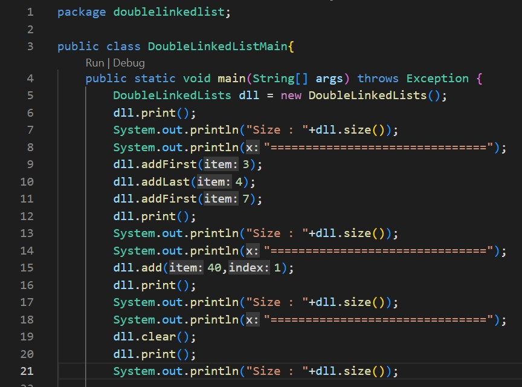
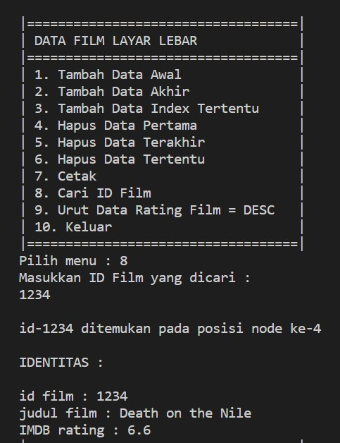

# **Laporan Praktikum**
# Jobsheet X - Double Linked List 
#### Oleh : Aryo Deva Saputra (TI-1G)
#### NIM : 2141720176

## 12.2 Kegitan Praktikum 1 
### 12.2.1 Percobaan 1 




### 12.2.2 Verifikasi Hasil Percobaan


### 12.2.3 Pertanyaan Percobaan
1. Jelaskan perbedaan antara single linked list dengan double linked lists !
   > **Single Linked List hanya memiliki satu variabel pointer saja yang menunjukkan node selanjutnya. Sedangkan Double Linked List memiliki dua variabel pointer yaitu pointer yang menunjuk ke node selanjutnya dan pointer yang menunjuk ke node sebelumnya.**
2. Perhatikan class Node, didalamnya terdapat atribut next dan prev. Untuk apakah atribut tersebut?
   > **Next digunakan untuk pointer selanjutnya(penunjuk alamat data selanjutnya), sedangkan prev digunakan untuk pointer sebelumnya(penunjuk alamat data sebelumnya)**
3. Perhatikan konstruktor pada class DoubleLinkedLists. Apa kegunaan inisialisasi atribut head dan size seperti pada gambar berikut ini?
```java
    public DoubleLinkedLists(){
        head = null;
        size = 0;
    }
```
> **Menandakan bahwa kondisi suatu linked list awalnya kosong dan data awalnya pun juga null(kosong)**
4. Pada method addFirst(), kenapa dalam pembuatan object dari konstruktor class Node prev dianggap sama dengan null?
```java
    Node newNode = new Node(null, item, head);
```
> **Karena node baru yang ditambahkan pada index ke-0 memiliki alamat prev null** 
5. Perhatikan pada method addFirst(). Apakah arti statement head.prev = newNode ?
> **Untuk menunjukkan bahwa prev node pada index ke-0 dari node yang lama digantikan dengan node yang baru**
6. Perhatikan isi method addLast(), apa arti dari pembuatan object Node dengan mengisikan parameter prev dengan current, dan next dengan null?
```java
    Node newNode = new Node(current, item, null);
```
> **Current digunkan untuk membuat head sementara yang nantinya akan digunakan sebagai penanda prev dari node baru yang akan ditambahkan, sedangkan next bernilai null, karena pada ujung double linked lists nilai dari next adalah null**

## 12.3 Kegitan Praktikum 2 
### 12.3.1 Percobaan 2 


### 12.3.2 Verifikasi Hasil Percobaan


### 12.3.3 Pertanyaan Percobaan
1. Apakah maksud statement berikut pada method removeFirst()?
```java
    head = head.next;
    head.prev = null;
```
> **Dikarenakan node pada index ke-0 dihapus, maka head yang baru dirubah ke node selanjutnya, sedangkan prev yang baru adalah bernilai null**
2. Bagaimana cara mendeteksi posisi data ada pada bagian akhir pada method removeLast()?
> **Dengan membuat duplikasi head berupa current, kemudian dilakukan perulangan hingga current berada pada 1 indeks sebelum ujung dari linked list(current.next.next == null)**
3. Jelaskan alasan potongan kode program di bawah ini tidak cocok untuk perintah remove!
```java
    Node tmp = head.next;
    tmp.next.prev = head;
```
> **Karena menyimpan data head jadi lebih baik di removefirst**
4. Jelaskan fungsi kode program berikut ini pada fungsi remove!
```java
    current.prev.next = current.next;
    current.next.prev = current.prev;
```
> **Jika kondisi node berada di tengah tengah maka pada saat penghapusan, alamat dari next dan prev akan dirubah ke next dan prev melewati nilai yang dihapus**

## 12.4 Kegitan Praktikum 3 
### 12.4.1 Percobaan 3 


### 12.4.2 Verifikasi Hasil Percobaan


### 12.4.3 Pertanyaan Percobaan
1. Jelaskan method size() pada class DoubleLinkedLists !
   > **Method size digunakan untuk menunjukan ukuran dari linked list yang telah dibuat dan default atau nilai awal dari size adalah 0**
2. Jelaskan cara mengatur indeks pada double linked lists supaya dapat dimulai dari indeks ke- 1!
   > **Mendeklarasikan nilai index = 1 dan dengan cara menginisialisasi perulangan index dari 1**
3. Jelaskan perbedaan karakteristik fungsi Add pada Double Linked Lists dan Single Linked Lists!
   > **Pada single linked list hanya perlu mengganti alamat dari next pada elemen yang ingin ditambahkan, sedangkan pada double linked lists penambahan elemen dilakukan dengan mengganti alamt next dan previous**
4. Jelaskan perbedaan logika dari kedua kode program di bawah ini!
```java
    public boolean isEmpty(){
        if(size==0){
            return true;
        } else {
            return false;
        }
    }
```
```java
    public boolean isEmpty(){
        return head == null;
    }
```
> **a. jika linked list kosong maka isEmpty() true, dan sebaliknya.**
> **b. mengecek apakah head == null**

## 12.5 Tugas Praktikum
1. Buat program antrian vaksinasi menggunakan queue berbasis double linked list sesuai ilustrasi dan menu di bawah ini! (counter jumlah antrian tersisa di menu cetak(3) dan data orang yang telah divaksinasi di menu Hapus Data(2) harus ada)
> **Screenshot kode program**


> **Screenshot hasil running program** 


2. Buatlah program daftar film yang terdiri dari id, judul dan rating menggunakan double linked lists, bentuk program memiliki fitur pencarian melalui ID Film dan pengurutan Rating secara descending. Class Film wajib diimplementasikan dalam soal ini.
> **Screenshot kode program**


> **Screenshot hasil running program** 





