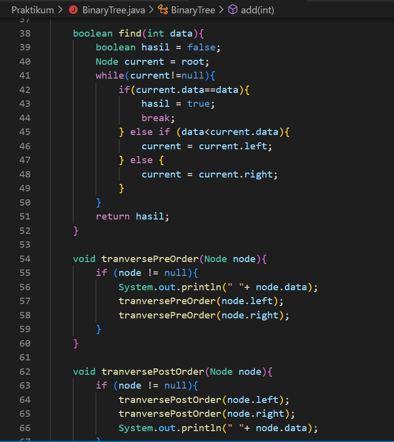
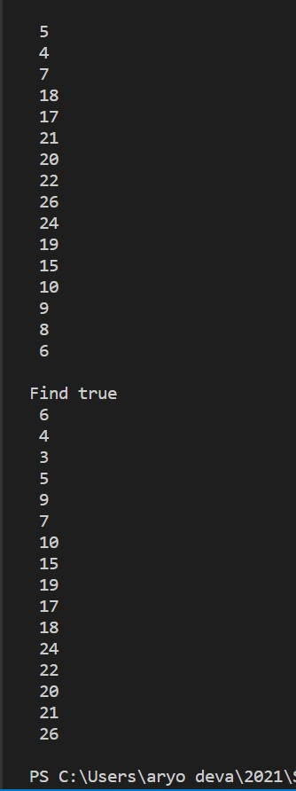

# **Laporan Praktikum**
# Jobsheet XIII - Tree 
#### Oleh : Aryo Deva Saputra (TI-1G)
#### NIM : 2141720176

## 2 Praktikum 
### 2.1 Implementasi Binary Search Tree menggunakan Linked List
### 2.1.1 Langkah-langkah percobaan





### 2.1.2 Verifikasi Hasil Percobaan


### 2.1.3 Pertanyaan Percobaan
1. Mengapa dalam binary search tree proses pencarian data bisa lebih efektif dilakukan dibanding binary tree biasa?
   > **Karena pada Binary Search Tree terdapat aturan bahwa setiap child node sebelah kiri selalu lebih kecil nilainya dari pada root node. Begitu pula sebaliknya, setiap child node sebelah kanan selalu lebih besar nilainya daripada root node. Hal ini membuat proses pencarian menjadi efisien**
2. Untuk apakah di class Node, kegunaan dari atribut left dan right?
   > **Kegunaannya adalah seperti prev dan next pada linked list, selain itu juga digunakan untuk menentukan leftchild dan rightchild**
3. a. Untuk apakah kegunaan dari atribut root di dalam class BinaryTree?
   > **Untuk menentukan nilai paling atas**
b. Ketika objek tree pertama kali dibuat, apakah nilai dari root?
> **kosong atau null**
4. Ketika tree masih kosong, dan akan ditambahkan sebuah node baru, proses apa yang akan terjadi?
   > **Node baru yang ditambahkan akan menjadi root**
5. Perhatikan method add(), di dalamnya terdapat baris program seperti di bawah ini. Jelaskan secara detil untuk apa baris program tersebut?
```java
    if(data<current.data){
        if(current.left!=null){
            current = current.left;
        }else{
            current.left = new Node(data);
            break;
        }
    }
```
> **jika data baru kurang dari data lama maka di lakukan pengecekan lagi apakah data  kiri bernilai sama dengan null, jika iya data lama akan maka akan masuk ke dalam data kiri, jika tidak maka data kiri di ganti dengan data yang baru saja di masukkan, setelah itu break**

### 2.2 Implementasi Binary Tree dengan Array
### 2.2.1 Langkah-langkah percobaan


### 2.2.2 Verifikasi Hasil Percobaan


### 2.2.3 Pertanyaan Percobaan
1. Apakah kegunaan dari atribut data dan idxLast yang ada di class BinaryTreeArray?
   > **data digunakan untuk menunjukkan panjang array, sedangkan idxLast untuk menentukan alamat agar tidak terjadi error waktu proses add**
2. Apakah kegunaan dari method populateData()?
   > **untuk menginput data agar dikenali indexnya**
3. Apakah kegunaan dari method traverseInOrder()?
   > **mengeprint seluruh data pada tree secara rekursif mulai dari sebelah kiri**
4. Jika suatu node binary tree disimpan dalam array indeks 2, maka di indeks berapakah posisi left child dan rigth child masing-masing?
   > **left=1 dan right=3**
5. Apa kegunaan statement int idxLast = 6 pada praktikum 2 percobaan nomor 4?
    > **Untuk membatasi index agar hanya menjadi 6**

### 13.3 Tugas Praktikum
1. Buat method di dalam class BinaryTree yang akan menambahkan node dengan cara rekursif.
   
   
   
   
2. Buat method di dalam class BinaryTree untuk menampilkan nilai paling kecil dan yang paling besar yang ada di dalam tree.
   
   
   
3. Buat method di dalam class BinaryTree untuk menampilkan data yang ada di leaf.
   *Jawaban berada di nomor 4*
4. Buat method di dalam class BinaryTree untuk menampilkan berapa jumlah leaf yang ada di dalam tree.
   
   
   
   
5. Modifikasi class BinaryTreeArray, dan tambahkan :
• method add(int data) untuk memasukan data ke dalam tree
```java
void add(int key) {
   idxLast++;
   data[idxLast] = key;
    }
```
• method traversePreOrder() dan traversePostOrder()
```java
   void traversePreOrder(int idxStart) {
      if (idxStart <= idxLast) {
         System.out.print(data[idxStart] + " ");
         traversePreOrder(2 * idxStart + 1);
         traversePreOrder(2 * idxStart + 2);
      }
   }

   void traversePostOreder(int idxStart) {
      if (idxStart <= idxLast) {
         traversePostOreder(2 * idxStart + 1);
         traversePostOreder(2 * idxStart + 2);
         System.out.print(data[idxStart] + " ");
     }
   }
```