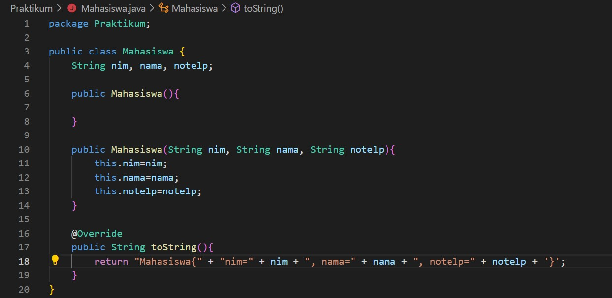

# **Laporan Praktikum**
# Jobsheet XVI - Collection 
#### Oleh : Aryo Deva Saputra (TI-1G)
#### NIM : 2141720176

## 16.2 Praktikum 1
### 16.2.1 Percobaan 1


### 16.2.2 Verifikasi Hasil Percobaan


### 16.2.3 Pertanyaan Percobaan
1. Perhatikan baris kode 25-36, mengapa semua jenis data bisa ditampung ke dalam sebuah Arraylist?
   > **Karena tidak di deklarasikan tipe datanya, maka list yang dibuat memiliki tipe data generic atau dapat menampung semua jenis tipe data**
2. Modifikasi baris kode 25-36 seingga data yang ditampung hanya satu jenis atau spesifik tipe tertentu!
   > 
   ```java 
      List<Integer> l = new ArrayList<>();
        l.add(1);
        l.add(2);
        l.add(3);
        l.add(4);
        System.out.printf("Elemen pertama : %d total elemen : %d elemen terakhir: %s\n", l.get(0), l.size(), l.get(l.size() - 1));
        ```
3. Ubah kode pada baris kode 38 menjadi seperti ini
   ```java
    LinkedList<String> names = new LinkedList<>();
   ```
4. Tambahkan juga baris berikut ini, untuk memberikan perbedaan dari tampilan yang sebelumnya
   ```java
   LinkedList<String> names = new LinkedList<>();
   names.push("Mei-mei");
        System.out.printf("Elemen 1 : %s total elemen : %s elemen terakhir : %s\n", names.getFirst(), names.size(), names.getLast());
        System.out.println("Names : "+ names.toString());
   ```
5. Dari penambahan kode tersebut, silakan dijalankan dan apakah yang dapat Anda jelaskan!
   
   > **Jika pada percobaan sebelumnya untuk menampilkan data pada index tertentu pemanggilan dilakukan dengan menyebutkan get(letak index) sedangkan setelah dimodifikasi hasil yang dikeluarkan sama namun jika ingin mengakses index tertentu dapat memanggil method yang berbeda seperti getFisrt atau getLast. Akan tetapi tidak akan menghasilkan error pada percobaan sebelumnya walaupun telah mengganti list dengan Linkedlist**

## 16.3 Praktikum 2
### 16.3.1 Percobaan 2


### 16.3.2 Verifikasi Hasil Percobaan


### 16.3.3 Pertanyaan Percobaan
1. Apakah perbedaan fungsi push() dan add() pada objek fruits?
   > **fungsi add akan menambahkan elemen pada bagian paling belakang, sedangkan fungsi push akan menambahkan elemen di posisi terdepan.**
2. Silakan hilangkan baris 43 dan 44, apakah yang akan terjadi? Mengapa bisa demikian?
   > **Stack akan bernilai kosong, karena sebelumnya telah dilakukan perintah pop yang mneyebabkan penghapusan elemen pada stack**
3. Jelaskan fungsi dari baris 46-49?
   > **Baris kode tersebut akan melakukan print elemen stack dengan menggunakan format dan memanfaatkan syntax foreach untuk melakukan perulangan**
4. Silakan ganti baris kode 25, Stack<String> menjadi List<String> dan apakah yang terjadi? Mengapa bisa demikian?
   > **Error, karena yang dapat dijadikan object adalah percabangan dari List, bukan List itu sendiri.**
5. Ganti elemen terakhir dari dari objek fruits menjadi “Strawberry”!
   >
6. Tambahkan 3 buah seperti “Mango”,”guava”, dan “avocado” kemudian dilakukan sorting!
   >

## 16.3 Praktikum 2
### 16.3.1 Percobaan 2



### 16.3.2 Verifikasi Hasil Percobaan


### 16.3.3 Pertanyaan Percobaan
1. Pada fungsi tambah() yang menggunakan unlimited argument itu menggunakan konsep apa? Dan kelebihannya apa?
   > **Konsep penggunaan parameter array yang panjangnya akan mengikuti inputan user, kelebihannya adalah fleksibilitas penambahan elemen jika tidak diketahui dengan pasti berapa banyak elemen yang harus ditambahkan**
2. Pada fungsi linearSearch() di atas, silakan diganti dengan fungsi binarySearch() dari collection!
   > 
3. Tambahkan fungsi sorting baik secara ascending ataupun descending pada class tersebut!

## 16.4 Tugas Praktikum 
1. Implementasikan stack menggunakan collection dengan contoh kasus tumpukan daftar film sesuai dengan fitur-fitur yang ditunjukkan pada gambar di bawah ini!
   > *Source kode berada pada folder tugas*
   **Hasil running program**
   
   
   
2. Buatlah implementasi program daftar nilai mahasiswa semester, minimal memiliki 3 class yaitu Mahasiswa, Nilai, dan Mata Kuliah. Khusus untuk data Mahasiswa dan Mata Kuliah harus sudah Page 7 of 18 diinisialisasi, sehingga ketika memasukkan data nilai data mahasiswa dan mata kuliah cukup menginputkan nim ataupun kode mata kuliah. Yang paling penting adalah antara objek mahasiswa, matakuliah, dan nilai harus saling terhubung.
   > *Source kode berada pada folder tugas*
   **Hasil running program**
   
   
   
   
   