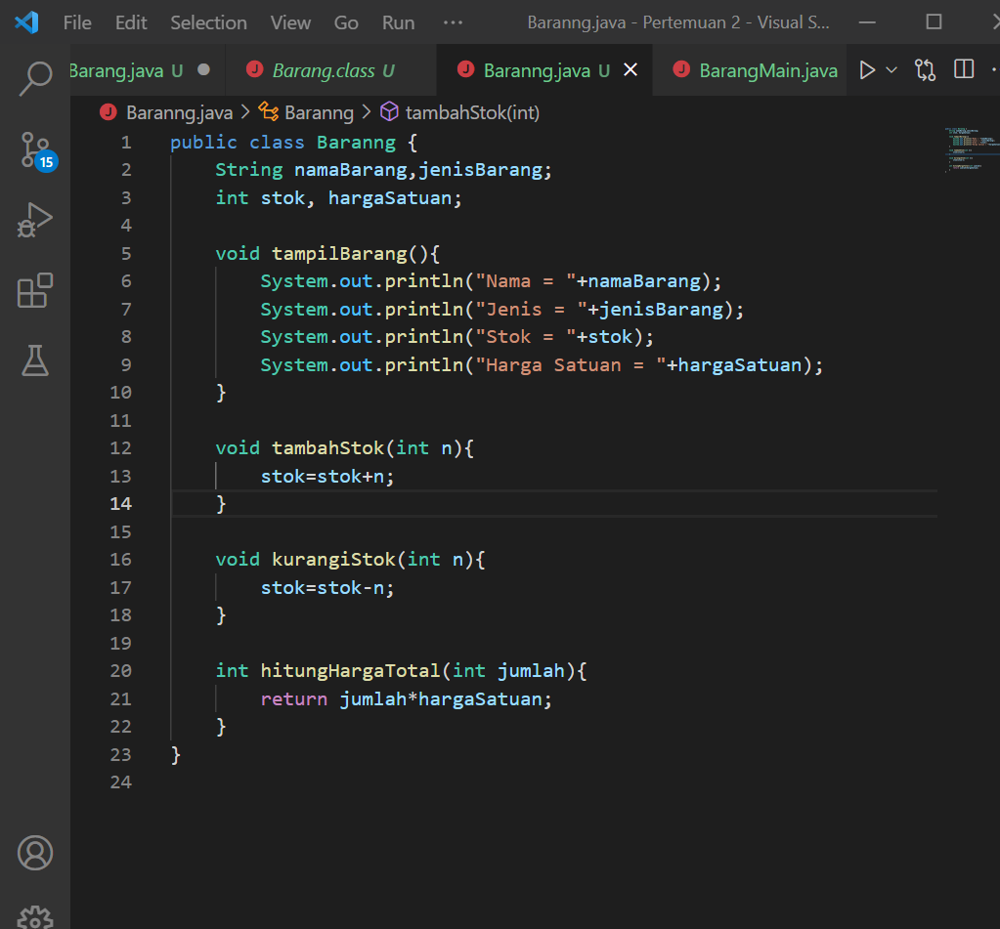
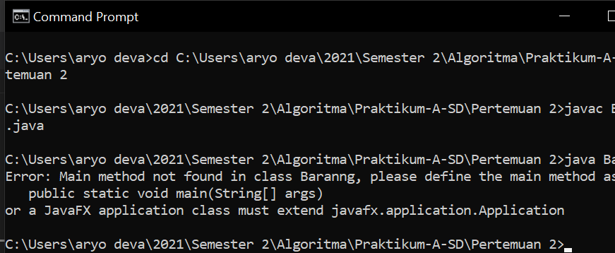
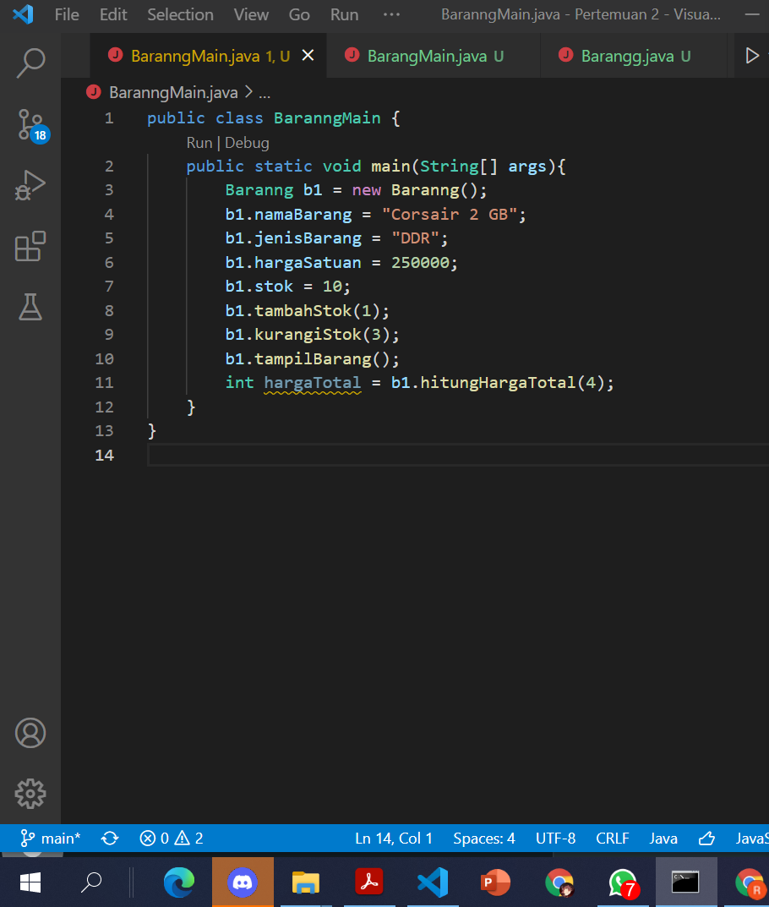
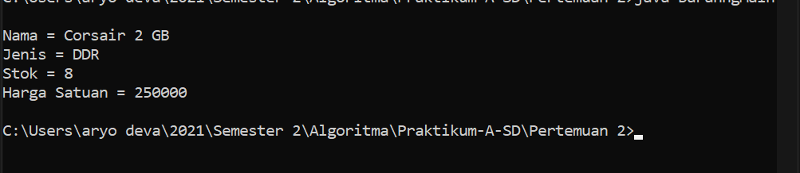
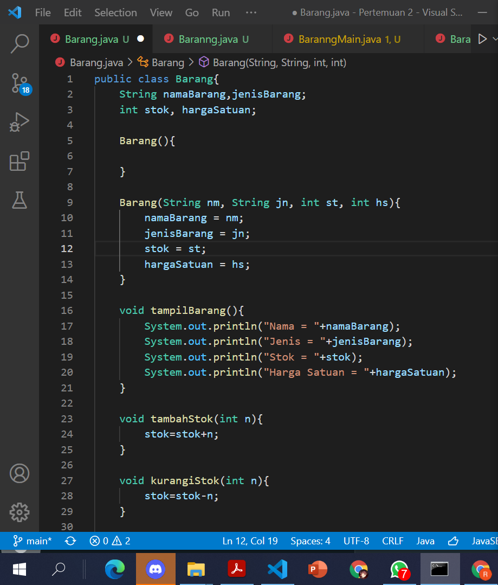
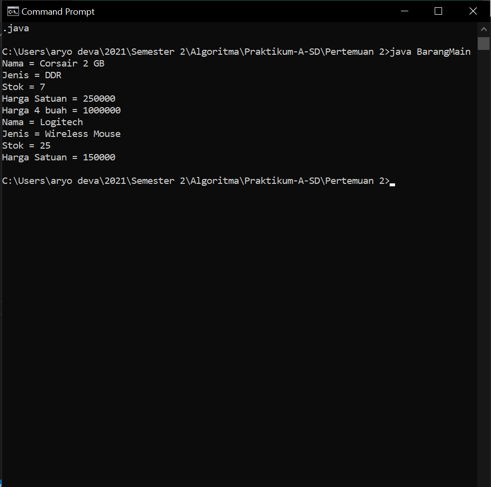

# Laporan Praktikum Pertemuan 2
# Jobsheet II - OBJEK 
oleh : Aryo Deva Saputra - 2141720176 (TI-1G)

## 2.2 Deklarasi Atribut, Class, dan Method 

### 2.2.1 Langkah - langkah Percobaan 

### 2.2.2 Verifikasi Hasil Percobaan     

### 2.2.3 Pertanyaan

1. Karakteristik class :
    a. tempat untuk membuat object
    b. rancangan yang tidak memiliki bentuk nyata
    Karakteristik object : 
    a. memiliki status
    b. memiliki tingkah laku
2. "Class" yang diikuti dengan nama classnya
3. Ada 4 : namaBarang, jenisBarang, stok, hargaSatuan, Dideklarasikan pada baris 13,14
4. Ada 4 : tampilBarang(): void, tambahStok(n:int): void, kurangiStok(n:int): void, hitungHargaTotal(jumlah:int):int, Dideklarasikan pada baris 16,23,27,31
5. void kurangiStok(int n){
        if (stok>0){
        stok=stok-n
        } 
        System.out.println("Stok tidak mencukupi/habis");
    } 
6. Untuk memberi nilai kepada n, sehingga saat stok bertambah dapat dihitung totalnya
7. Karena hasil perhitungan dari harga total harus mereturnkan angka yang memiliki tipe data int
8. karena tidak ada hal yang direturnkan, sehingga tambahStok memiliki tipe data void

## 2.3 Instansiasi Objek dan Mengakses Atribut & Method 

### 2.3.1 Langkah-langkah Percobaan 

### 2.3.2 Verifikasi Hasil Percobaan 

### 2.3.3 Pertanyaan

1. instansiasi dilakukan terdapat pada baris 15, nama objeknya yaitu b1  
2. Dengan mengetikkan nama objek yang telah di instansiasi lalu ketikan atribut atau method.  
       Contoh: b1.stock, b1.tampilBarang()

## 2.4 Membuat Konstruktor

### 2.4.1 Langkah langkah Percobaan 

### 2.4.2 Verifikasi Hasil Percobaan 

### 2.4.3 Pertanyaan 

1. baris 18
2. Instansiasi konstruktor berparameter dengan nama objek baru yaitu b2
3. Barang b3 = new Barang("Buku Gambar A3", "Alat Tulis", 4, 10000);

## 2.5 Latihan Praktikum

### 1. Jawaban 

### 2. Jawaban 

