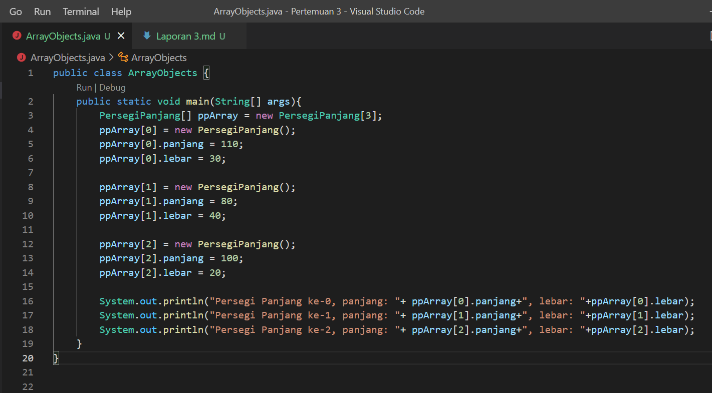
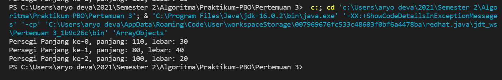
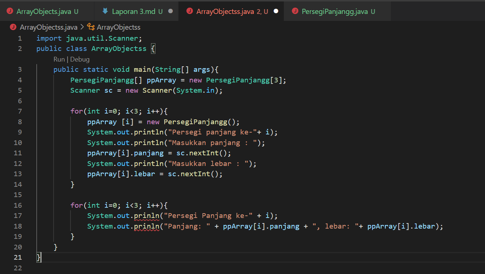
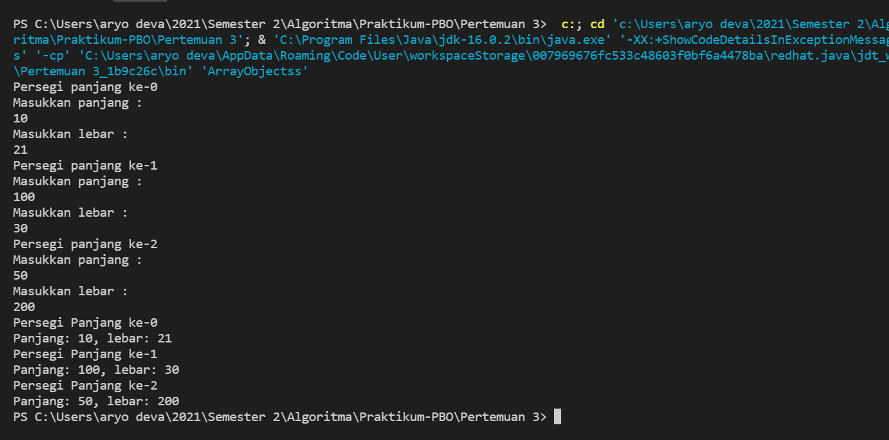
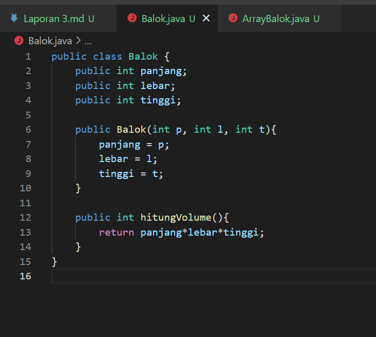
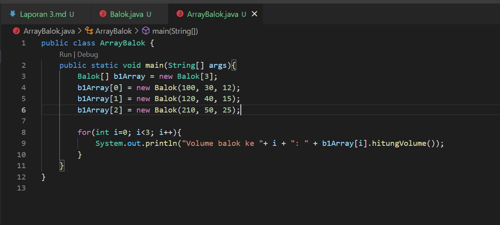
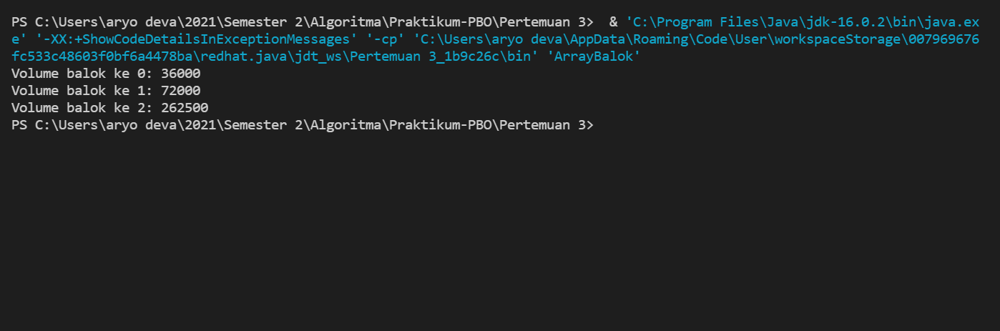

# **Laporan Praktikum 3**
# Jobsheet III - Array of Objek 
#### Oleh : Aryo Deva Saputra (TI-1G)
#### NIM : 2141720176 

## 3.2 Membuat Array dari Object, Mengisi dan Menampilkan
### 3.2.1 Langkah langkah Percobaan 



### 3.2.2 Verifikasi Hasil Percobaan 


### 3.2.3 Pertanyaan 
1. Berdasarkan uji coba 3.2, apakah class yang akan dibuat array of object harus selalu memiliki atribut dan sekaligus method? Jelaskan!  
**Menurut saya untuk atribut wajib dimiliki, sedangkan method tidak. Karena pada percobaan 3.2 diatas kita harus memasukkan atribut berupa panjang dan lebar yang dimana itu adalah atribut dari objek Persegi Panjang.**   

2. Apakah class PersegiPanjang memiliki konstruktor ? Jika tidak, kenapa dilakukan pemanggilan konstruktur pada baris program berikut :  
```java
ppArray[1] = new PersegiPanjang();
```
**Tidak, untuk membuat objek PersegiPanjang pada index array 1**  

3. Apa yang dimaksud dengan kode berikut ini:
```java
PersegiPanjang[] ppArray = new PersegiPanjang[3];
```
**Untuk membuat ppArray memiliki/menampung 3 buah objek PersegiPanjang**  

4. Apa yang dimaksud dengan kode berikut ini: 
```java
ppArray[1] = new PersegiPanjang();
ppArray[1].panjang = 80;
ppArray[1].lebar = 40;
```
**Untuk instansiasi objek, membuat objek PersegiPanjang  ke index array 1 dan mengisi atribut array index 1 berupa panjang = 80 dan lebar = 40**  

5. Mengapa class main dan juga class PersegiPanjang dipisahkan pada uji coba 3.2?
    **Agar terlihat lebih fleksibel dalam menunjukkan class dan objek itu sendiri**  

## 3.3 Menerima Input Isian Array Menggunakan Looping
### 3.3.1 Langkah langkah Percobaan 


### 3.3.2 Verifikasi Hasil Percobaan


### 3.3.3 Pertanyaan
1. Apakah array of object dapat diimplementasikan pada array 2 Dimensi?  
    **Bisa**  

2. Jika jawaban soal no satu iya, berikan contohnya! Jika tidak, jelaskan!
``` java
    Mahasiswa[][] mhs = new Mahasiswa[2][2];
    mhs[0][0] = new Mahasiswa();
```  

3. Jika diketahui terdapat class Persegi yang memiliki atribut sisi bertipe integer, maka kode 
dibawah ini akan memunculkan error saat dijalankan. Mengapa?  
``` java
    Persegi[] pgArray = new Persegi[100];
    pgArray[5].sisi = 20;
```  
**Karena kita belum melakukan pembuatan objek pada index array 5. Seharusnya setelah baris ke1 ada baris seperti berikut :**
``` java
    pgArray[5] = new Persegi();
```
4. Modifikasi kode program pada praktikum 3.3 agar length array menjadi inputan dengan Scanner!  

    ``` java
    System.out.print("Masukkan panjang array : ");
    int z = sc.nextInt();
    PersegiPanjang[] ppArray = new PersegiPanjang[z];
    ```

5. Apakah boleh Jika terjadi duplikasi instansiasi array of objek, misalkan saja instansiasi dilakukan pada ppArray[i] sekaligus ppArray[0] ? Jelaskan !  
**Boleh, saya telah menginsatnsiasi objek m[0] = new mahasiswa(); berkali-kali dan tidak terjadi error bahkan program dapat dijalankan tanpa kendala. Tetapi program nya jadi kurang efektif dan efisien**  
    
## 3.4 Operasi Matematika Atribut Object Array
### 3.4.1 Langkah langkah Percobaan



### 3.4.2 Verifikasi Hasil Percobaan 


### 3.4.3 Pertanyaan 
1. Dapatkah konstruktor berjumlah lebih dalam satu kelas? Jelaskan dengan contoh!   
    **Dapat**  
    ``` java
    public class luasRumah{
        int panjang, lebar;
        public luasRumah(){

        }
        public luasRumah(int a, int b) {
            panjang = a;
            lebar = b;
        }
    }
    ```
    **Contoh tersebut adalah konstruktor tidak berparameter dan konstruktor berparameter**  

2. Jika diketahui terdapat class Segitiga seperti berikut ini: 

```java
public class Segitiga{
    public int alas;
    public int tinggi;
}
``` 
Tambahkan konstruktor pada class Segitiga tersebut yang berisi parameter int a, int t yang masing-masing digunakan untuk mengisikan atribut alas dan tinggi.  
``` java
public Segitiga(int a, int t){
    alas = a;
    tinggi = t;
    }
}
```

3. Tambahkan method hitungLuas() dan hitungKeliling() pada class Segitiga
tersebut.   

``` java
public class Segitiga{
    public int alas;
    public int tinggi;
        
    public Segitiga(int a, int t){
        alas = a;
        tinggi = t;
    }

    int hitungLuas(){
        return alas*tinggi/2;
        }

    double hitungKeliling(){
        return Math.sqrt(((alas*0.5)*(alas*0.5))+(tinggi*tinggi))*2+alas;
        }
    }
```  
4. Pada fungsi main, buat array Segitiga sgArray yang berisi 4 elemen, isikan masing-masing 
atributnya sebagai berikut:  
sgArray ke-0 alas: 10, tinggi: 4  
sgArray ke-1 alas: 20, tinggi: 10  
sgArray ke-2 alas: 15, tinggi: 6  
sgArray ke-3 alas: 25, tinggi: 10  

``` java
    public class SegitigaMain{
        public static void main(String[] args){
            Segitiga[] sgArray = new Segitiga[4];
            for (int i = 0 ; i < sgArray.length ; i++){
                sgArray[i] = new Segitiga();
            }
            sgArray[0].alas = 10;
            sgArray[0].tinggi = 4;
            sgArray[1].alas = 20;
            sgArray[1].tinggi = 10;
            sgArray[2].alas = 15;
            sgArray[2].tinggi = 6;
            sgArray[3].alas = 25;
            sgArray[3].tinggi = 10;
        }
    }
```

5. Kemudian menggunakan looping, cetak luas dan keliling dengan cara memanggil method 
hitungLuas() dan hitungKeliling().  

``` java
    public class SegitigaMain{
        public static void main(String[] args){
            Segitiga[] sgArray = new Segitiga[4];
            for (int i = 0 ; i < sgArray.length ; i++){
                sgArray[i] = new Segitiga();
            }
            sgArray[0].alas = 10;
            sgArray[0].tinggi = 4;
            sgArray[1].alas = 20;
            sgArray[1].tinggi = 10;
            sgArray[2].alas = 15;
            sgArray[2].tinggi = 6;
            sgArray[3].alas = 25;
            sgArray[3].tinggi = 10;

            for (int i = 0 ; i < sgArray.length ; i++){
                System.out.println("Luas Segitiga ke - " + (i+1) + " adalah : " + 
                sgArray[i].hitungLuas());
                System.out.println("Keliling Segitiga ke - " + (i+1) + " adalah : " + 
                sgArray[i].hitungKeliling());
                }
            }
        }
```

## 3.5 Latihan Praktikum 

### NO.1
##### Screenshot Hasil


### NO.2
#### Screenshot Hasil 


### NO.3
#### Screenshot Hasil


