# **Laporan Praktikum 4**
# Jobsheet IV - Brute Force & Divide Conquer 
#### Oleh : Aryo Deva Saputra (TI-1G)
#### NIM : 2141720176 

## 4.2 Menghitung Nilai Faktorial dengan Algoritma Brute Force dan Divide and Conquer
### 4.2.1 Langkah-langkah Percobaan 
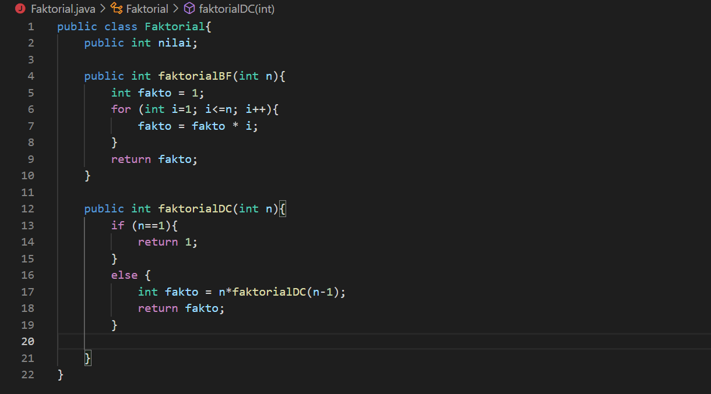
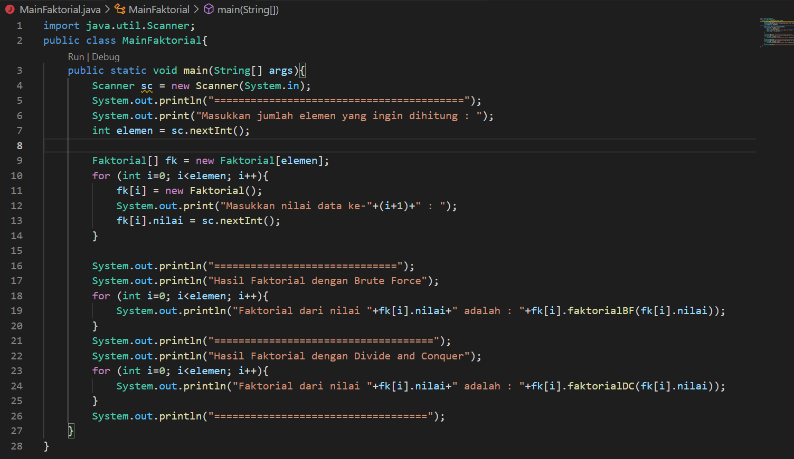

### 4.2.2 Verifikasi Hasil Percobaan
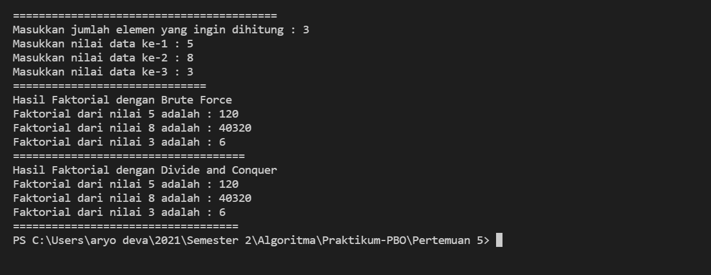

### 4.2.3 Pertanyaan
1. Jelaskan mengenai base line Algoritma Divide Conquer untuk melakukan  pencarian nilai faktorial !
   >**Jika nilai dari n sama dengan 1, maka program akan melakukan return 1. Jika tidak maka nilai daripada variable n akan dikurangi  1 dan dilakukan perulangan dan dikalikan dengan bilangan sebelumnya hingga mereturnkan nilai fakto**
2. Pada implementasi Algoritma Divide and Conquer Faktorial apakah lengkap terdiri dari 3 tahapan divide, conquer, combine ? Jelaskan masing-masing bagiannya pada kode program !
    > **Divide = faktorialDC(n-1) pengurangan pada nilai n.**
    > **Conquer = n*.faktorialDC(n-1) penyelesaian dengan rekursif.** 
    > **Combine = n*faktorialDC(n-1) pengombinasian dengan perkalian.**
3. Apakah memungkinkan perulangan pada method faktorialBF() dirubah selain menggunakan for ? Buktikan !
   > **Memungkinkan, selain menggunakan for dapat mengunakan while dan do-while**
   ```java
    public int faktorialBF(int n){
        int fakto = 1;
        int i=1;
        while (i<n){
            fakto = fakto * i;
            i++
        }
        return fakto;
    }

    atau 

    do {
        fakto =fakto*i;
        i++;
    } while (i<=n);
    return fakto;
    ```
4. Tambahkan pegecekan waktu eksekusi kedua jenis method tersebut!
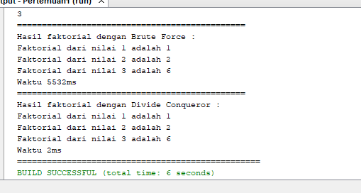
5. Buktikan dengan inputan elemen yang di atas 20 angka, apakah ada perbedaan waktu eksekusi ?
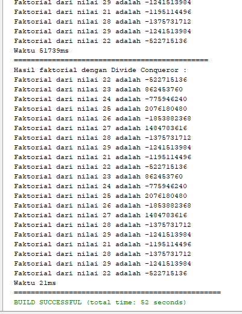

## 4.3 Menghitung Hasil Pangkat dengan Algoritma Brute Force dan Divide and Conquer
### 4.3.1 Langkah-langkah Percobaan
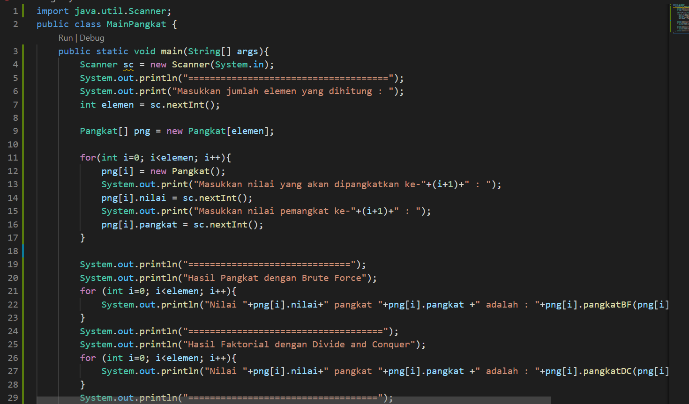
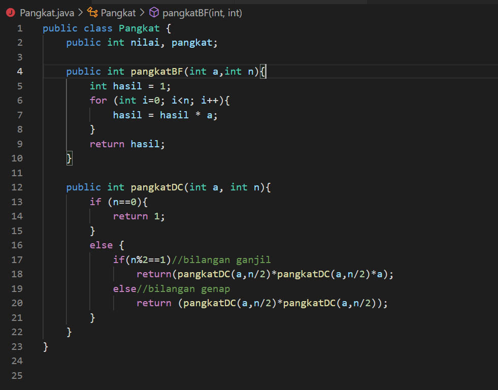

### 4.3.2 Verifikasi Hasil Percobaan 


### 4.3.3 Pertanyaan
1. Jelaskan mengenai perbedaan 2 method yang dibuat yaitu PangkatBF() dan PangkatDC()!
    > Perbedaan dari method PangkatBF() dan PangkatDC() yaitu, pada method pangkatBF() menggunakan fungsi iterative (fungsi yang melakukan perulangan yang melakukan proses perulangan terhadap sekelompok intruksi. Perulangan dilakukan dalam batasan syarat tertentu. Ketika syarat tersebut tidak terpenuhi lagi maka perulangan akan terhenti). Sedangkan pada method pangkatDC() menggunakan fungsi rekursif yang  mana pada fungsi ini perulangan yang terjadi akibat pengeksekusian suatu fungsi yang mana fungsi tersebut memanggil dirinya sendiri. 
2. Pada method PangkatDC() terdapat potongan program sebagai berikut :
```java
if(n%2==1)//bilangan ganjil
    return (pangkatDC(a,n/2)*pangkatDC(a,n/2)*a);
else//bilangan genap
    return (pangkatDC(a,n/2)*pangkatDC(a,n/2));
```
Jelaskan arti potongan kode tersebut!
> Jika n yang dimasukkan bernilai ganjil maka akan mereturnkan di bagi 2 kemudian dikalikan dengan method itu sendiri dan kemudian di kalikan lagi dengan variable a 
3. Apakah tahap combine sudah termasuk dalam kode tersebut?Tunjukkan!
   > Tahap combine sudah terjadi pada kode tersebut, dan lebih tepatnya tahapan tersebut di lakukan pada class Pangkat
- Contoh : 
  ```java
  return (pangkatDC(a, n/2) * pangkatDC(a, n/2));
  ```
4. Modifikasi kode program tersebut, anggap proses pengisian atribut dilakukan dengan konstruktor.
   ```java
   int elemen = sc.nextInt();
   Pangkat[] png = new Pangkat[elemen];

   for (int i=0; i<elemen; i++){
       System.out.println("Masukkan nilai yang akan dipangkatkan ke-"+(i+1)+" : ");
       int bil = nextInt();
       System.out.println("Masukkan nilai pangkat ke-" + (i+1) + " : ");
   }
   ```
5. Tambahkan menu agar salah satu method yang terpilih saja yang akan dijalankan!
   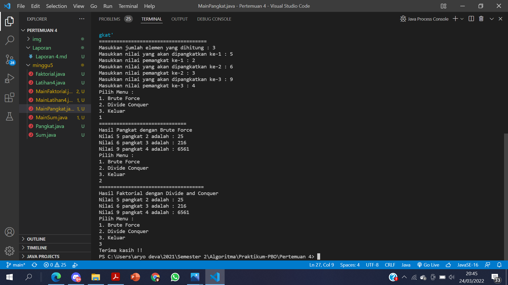

## 4.4 Menghitung Sum Array dengan Algoritma Brute Force dan Divide and Conquer
### 4.4.1 Langkah-langkah Percobaan
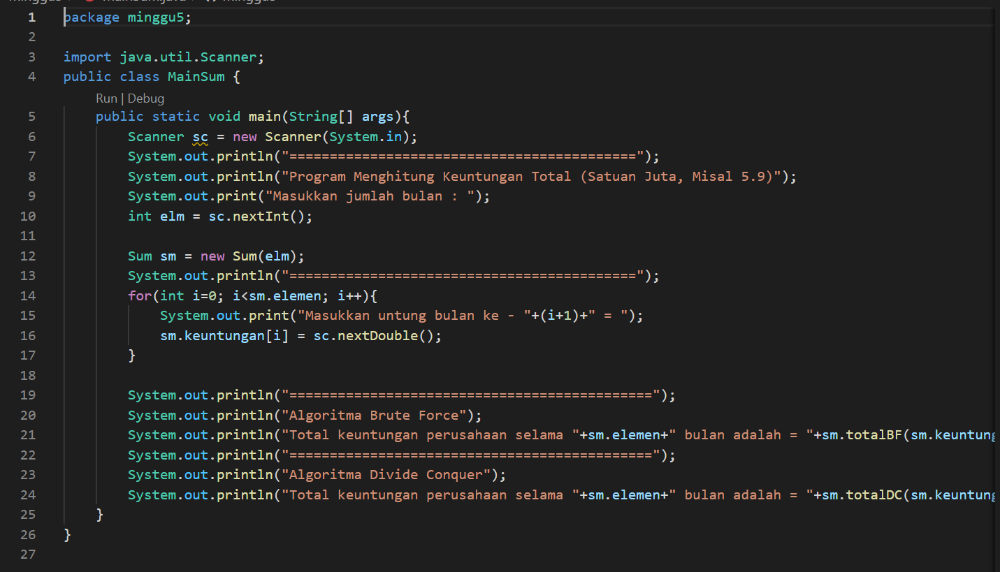
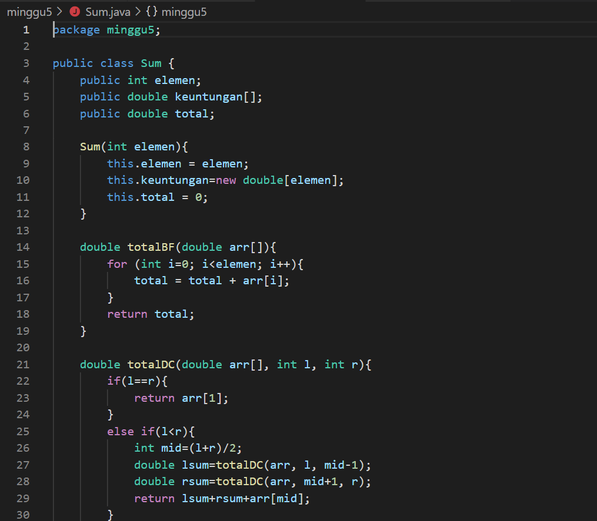

### 4.4.2 Verifikasi Hasil Percobaan
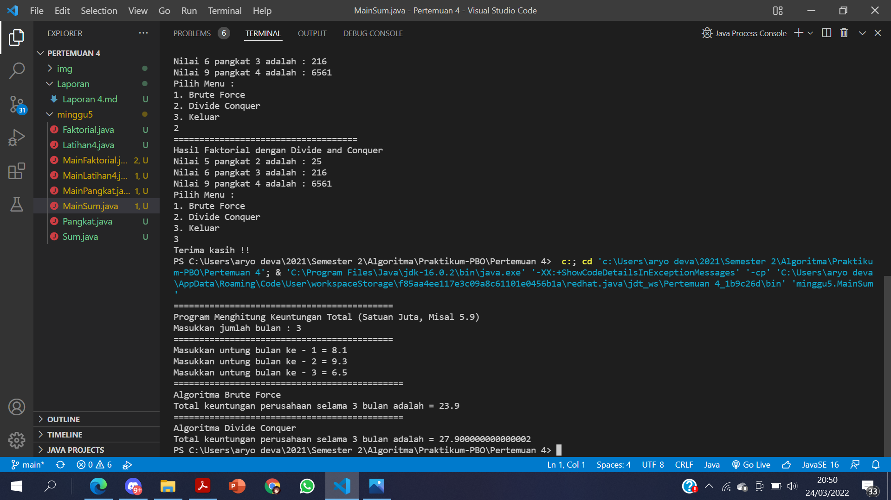

### 4.4.3 Pertanyaan
1. Berikan ilustrasi perbedaan perhitungan keuntungan dengan method TotalBF() ataupun TotalDC()
   > a. Pada method TotalBF(), kode program terkesan lebih ringkas dan sederhana, dan menjadikannya lebih mudah untuk di pahami karena perhitungan dilakukan secara berurutan dari awal hingga akhir
   > b. Pada method TotalDC(), kode program lebih panjang daripada kode program pada method TotalBF(),namun method ini memiliki keuntungan yang mana pada method ini kita dapat memecahkan masalah atau case yang sulit karena perhitungan dilakukan dengan cara dibagi-bagi dan digabungkan di akhir 
2. Perhatikan output dari kedua jenis algoritma tersebut bisa jadi memiliki hasil berbeda di belakang koma. Bagaimana membatasi output di belakang koma agar menjadi standar untuk kedua jenis algoritma tersebut.
   > Dengan cara mengganti syntax println menjadi syntax printf dan juga teknik pembatasan karakter.
3. Mengapa terdapat formulasi return value berikut?Jelaskan!
```java
    return lsum+rsum+arr[mid];
```
   > Return value tersebut berguna untuk mengembalikan nilai dari variable lsum,variable rsum dan juga arr [mid] yang mana masing-masing nya di jumlah kan terlebih dahulu.

4. Kenapa dibutuhkan variable mid pada method TotalDC()?
   > Di butuhkan variable mid pada method TotalDC() yakni guna menampng nilai dari perhitungan (1+r)/2 yang mana nantinya akan gi gunakan sebagai pengisian nilai pada parameter di method TotalDC().
5. Program perhitungan keuntungan suatu perusahaan ini hanya untuk satu perusahaan saja. Bagaimana cara menghitung sekaligus keuntungan beberapa bulan untuk beberapa perusahaan.(Setiap perusahaan bisa saja memiliki jumlah bulan berbeda-beda)? Buktikan dengan program!
   > 
   

## 4.5 Latihan Praktikum
### Screenshot hasil program
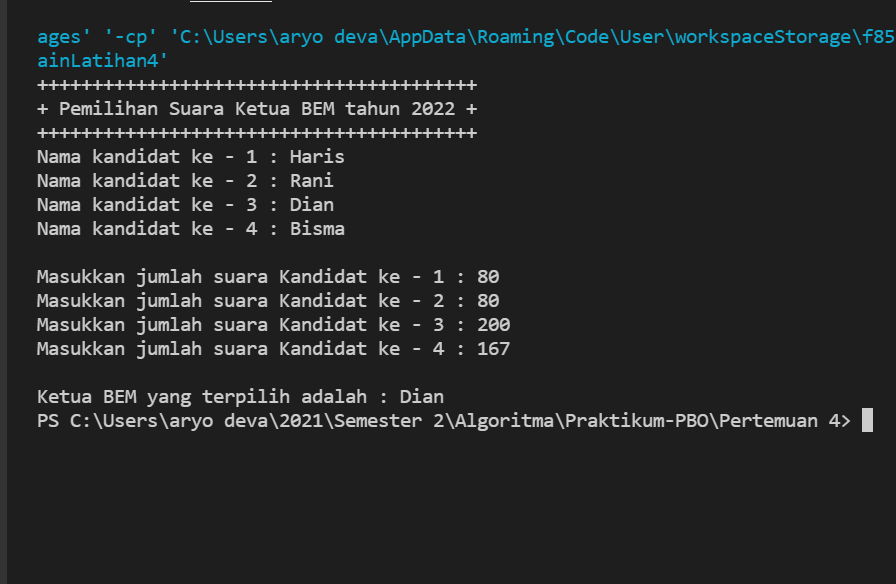