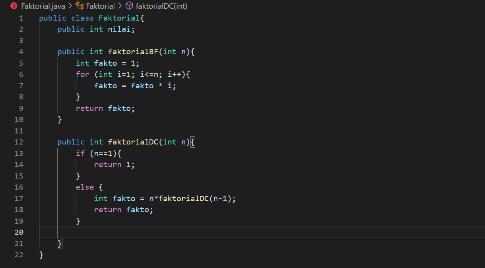
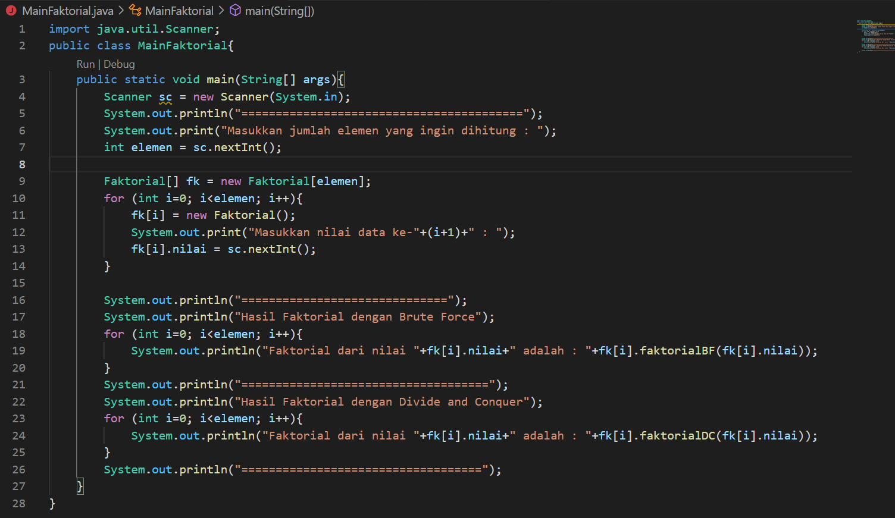
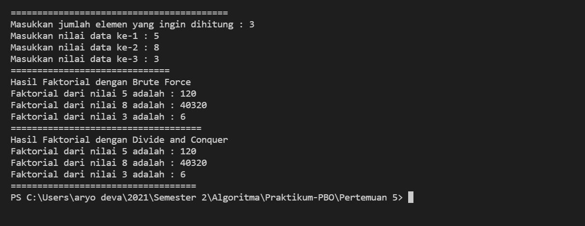

# **Laporan Praktikum 4**
# Jobsheet IV - Brute Force & Divide Conquer 
#### Oleh : Aryo Deva Saputra (TI-1G)
#### NIM : 2141720176 

## 4.2 Menghitung Nilai Faktorial dengan Algoritma Brute Force dan Divide and Conquer
### 4.2.1 Langkah-langkah Percobaan 

### 4.2.2 Verifikasi Hasil Percobaan

### 4.2.3 Pertanyaan
1. Jelaskan mengenai base line Algoritma Divide Conquer untuk melakukan  pencarian nilai faktorial !
2. Pada implementasi Algoritma Divide and Conquer Faktorial apakah lengkap terdiri dari 3 tahapan divide, conquer, combine ? Jelaskan masing-masing bagiannya pada kode program !
3. Apakah memungkinkan perulangan pada method faktorialBF() dirubah selain menggunakan for ? Buktikan !
4. Tambahkan pegecekan waktu eksekusi kedua jenis method tersebut!
5. Buktikan dengan inputan elemen yang di atas 20 angka, apakah ada perbedaan waktu eksekusi ?

## 4.3 Menghitung Hasil Pangkat dengan Algoritma Brute Force dan Divide and Conquer
### 4.3.1