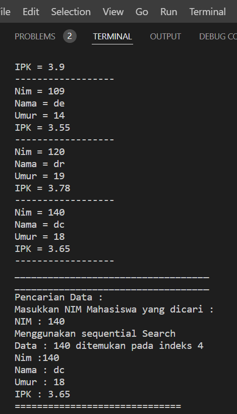
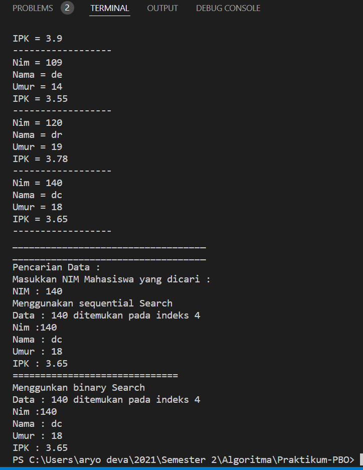

# **Laporan Praktikum 6**
# Jobsheet VI - Searching 
#### Oleh : Aryo Deva Saputra (TI-1G)
#### NIM : 2141720176

## 6.2 Searching / Pencarian Menggunakan Algoritma Sequential
### 6.2.1 Langkah-langkah Percobaan 


### 6.2.2 Verifikasi Hasil Percobaan


### 6.2.3 Pertanyaan
1. Jelaskan perbedaan metod TampilData dan Tampilposisi pada class PencarianMhs  
- **TampilData menampilkan semua atribut object class berdasarkan index atau data yang kita cari. Sedangkan TampilPosisi menampilkan index dari object class yang didalamnya terdapat nim yang dicari.**

1. Jelaskan fungsi break pada kode program dibawah ini!  
- **Untuk keluar dari perulangan agar posisi tidak terupdate setelah j ditemukan dan apabila data yang ditemukan lebih dari 1 maka index yang ditemukan lebih dulu lah yang tersimpan dalam variabel posisi**

3. Jika Data Nim yang dimasukkan tidak terurut dari kecil ke besar. Apakah program masih dapat 
berjalan? Apakah hasil yang dikeluarkan benar? Mengapa demikian!  
- **Karena Algoritma Sequential Search mengecek setiap data dan membandingkan data tersebut dengan data yang kita cari jadi tidak perlu terurut. Jadi sequential search mengecek data dari index 0 sampai panjang array terakhir dengan data yang kita cari.**

## 6.3 Searching / Pencarian Menggunakan Binary Search
### 6.3.1 Langkah-langkah Percobaan 


### 6.3.2 Verifikasi Hasil Percobaan


### 6.3.3 Pertanyaan
1. Tunjukkan pada kode program yang mana proses divide dijalankan!  
```java
if (right >= left) {
            mid = (left + right) / 2;
``` 

2. Tunjukkan pada kode program yang mana proses conquer dijalankan!  
```java
if (cari == listMhs[mid].nim) {
                return (mid);
            } else if (listMhs[mid].nim > cari) {
                return FindBinarySearch(cari, left, mid - 1);
            } else {
                return FindBinarySearch(cari, mid + 1, right);
            }
```

3. Jika data Nim yang dimasukkan tidak urut. Apakah program masih dapat berjalan? Mengapa 
demikian!  
- **Program dapat berjalan tetapi algoritma dari binary search tidak dapat dijalankan. Binary seacrh memerlukan data terurut karena nantinya kita akan mencari data yang kita cari berdasarkan nilai tengah data, lalu jika lebih kecil atau besar kita akan mengubah index sampai index mid sama seperti index dari data yang kita cari. Untuk itu kita memrlukan data yang sudah terurut agar algoritmanya dapat berjalan dengan baik dan benar**

4. Jika Nim yang dimasukkan dari NIM terbesar ke terkecil (missal : 20215, 20214, 20212, 20211, 20210) dan elemen yang dicari adalah 20210. Bagaimana hasil dari binary search? Apakah sesuai? Jika tidak sesuai maka ubahlah kode program binary seach agar hasilnya sesuai.
- **Hasilnya tidak sesuai, maka dari itu tanda > diubah menjadi <**
```java
int FindBinarySearch(int cari, int left, int right) {
        int mid;
        if (right >= left) {
            mid = (left + right) / 2;
            if (cari == listMhs[mid].nim) {
                return (mid);
            } else if (listMhs[mid].nim < cari) {
                return FindBinarySearch(cari, left, mid - 1);
            } else {
                return FindBinarySearch(cari, mid + 1, right);
            }
        }
        return -1;
    }
```
5. Modifikasilah program diatas yang mana jumlah mahasiswa yang di inputkan sesuai dengan 
masukan dari keyboard.
- **Pada baris :**
``` java
  PencarianMhs data = new PencarianMhs();
        int jumMhs = 5;
``` 
- **diganti menjadi :**
```java
System.out.print("Masukkan jumlah Mahasiswa : ");
        int jumMhs = s.nextInt();
        PencarianMhs data = new PencarianMhs(jumMhs);
```
- **Pada baris :**
``` java
Mahasiswa listMhs[] = new Mahasiswa[5];
    int idx;
```
- **diganti menjadi :**
```java
Mahasiswa listMhs[];
    int idx;

    PencarianMhs(int length){
        this.listMhs = new Mahasiswa[length];
    }
```

## 6.4 Percobaan Pengayaan Divide and Conquer
### 6.4.1 Langkah-langkah Percobaan 


### 6.4.2 Verifikasi Hasil Percobaan


### 6.5 Pertanyaan
1. Modifikasi percobaan searching diatas dengan ketentuan berikut ini
- Sebelum dilakukan searching dengan binary search data harus dilakukan pengurutan dengan menggunakan algoritma sorting (pilih salah satu algoritma sorting dari pertemuan sebelumnya) 
 **source code ada pada folder minggu 6**
 **hasil running program**


2. Modifikasi percobaan searching diatas dengan ketentuan berikut ini
- Pencarian dilakukan berdasarkan Nama Mahasiswa (gunakan Algoritma Sequential Search)
- Jika terdapat nama yang sama? Bagaimana keluaran dari kode program ketika pencarian dilakukan pada nama yang sama!
**source code ada pada folder minggu 6**
**hasil running program**


**Jika terdapat nama sama maka nama pada indeks yang lebih rendah lah yang ditampilkan karena terdapat break pada sequential search setelah method tersebut menemukan data yang dicari.** 

3. **source code ada pada folder minggu 6 file latihanmain.java**
- hasil running program
