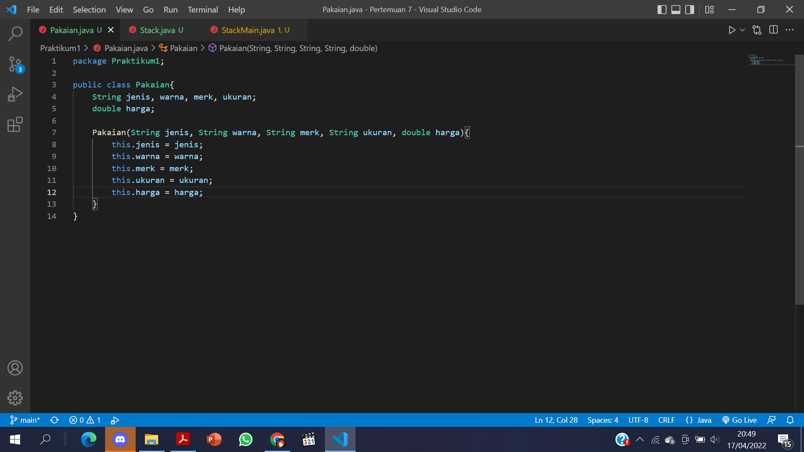
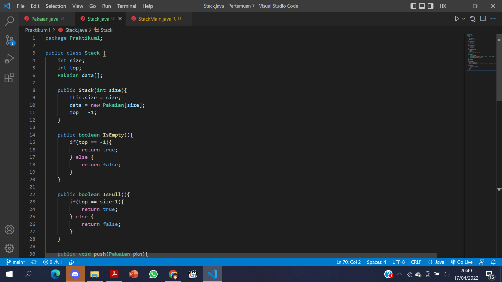
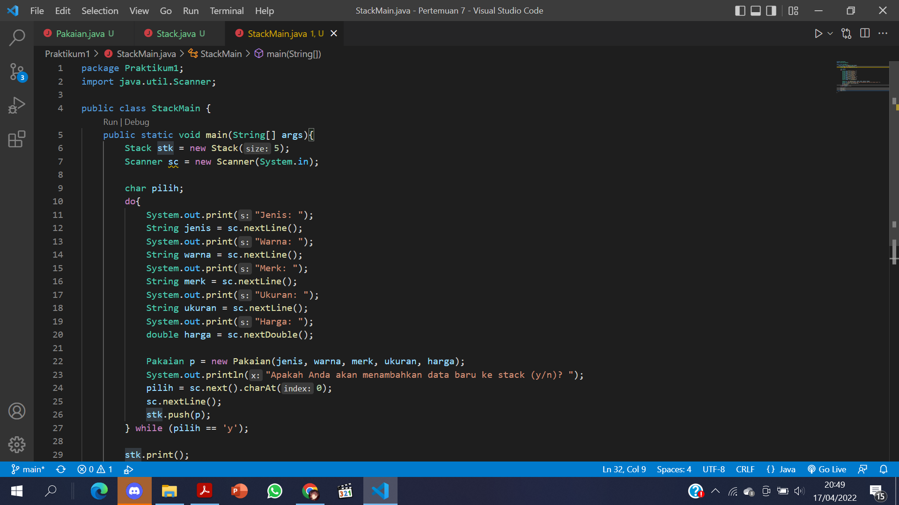
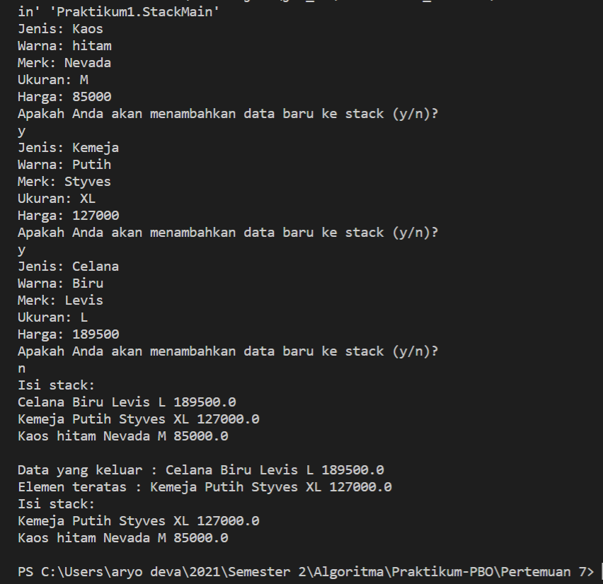
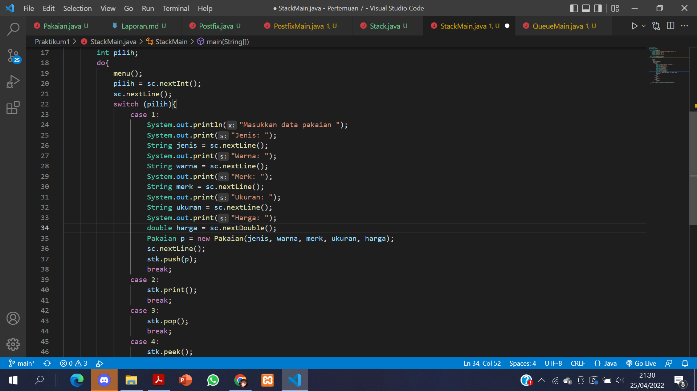
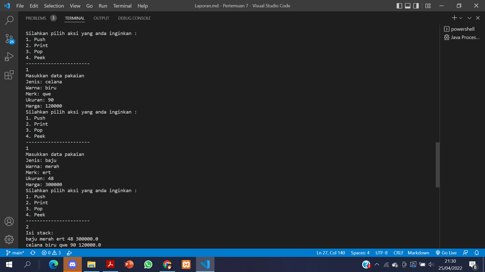
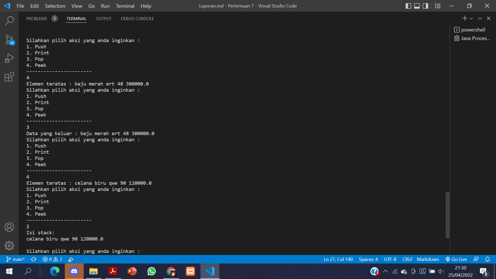
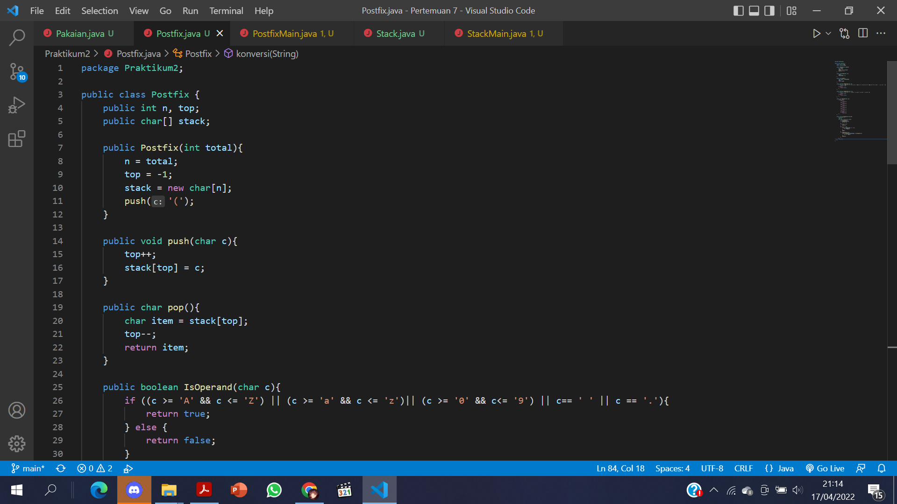
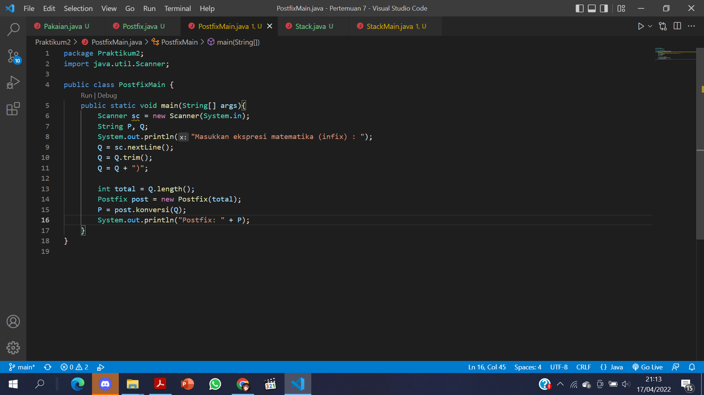
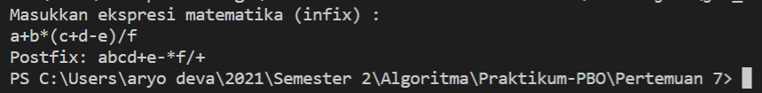

# **Laporan Praktikum 7**
# Jobsheet VII - Stack 
#### Oleh : Aryo Deva Saputra (TI-1G)
#### NIM : 2141720176

## 7.2 Praktikum 1
### 7.2.1 Langkah-langkah Percobaan 




### 7.2.2 Verifikasi Hasil Percobaan


### 7.2.3 Pertanyaan
1. Berapa banyak data pakaian yang dapat ditampung di dalam stack? Tunjukkan potongan kode program untuk mendukung jawaban Anda tersebut!
> **Banyaknya data yang dapat ditampung yaitu 5**
```java
    Stack stk = new Stack(5);
```
2. Perhatikan class StackMain, pada saat memanggil fungsi push, parameter yang dikirimkan adalah p. Data apa yang tersimpan pada variabel p tersebut?
```java
    stk.push(p);
```
> **Data yang tersimpan dalam parameter p tersebut adalah data pakaian yang bersisi jenis, warna, merk, ukuran, harga dari pakaian yang baru ditambahkan**
3. Apakah fungsi penggunaan do-while yang terdapat pada class StackMain?
   > **Agar input data kedalam stack dapat dilakukan berulang kali dan akan berhenti jika stack penuh atau user menghentikan pengisian data**
4. Modifikasi kode program pada class StackMain sehingga pengguna dapat memilih operasi-operasi pada stack (push, pop, peek, atau print) melalui pilihan menu program dengan memanfaatkan kondisi IF-ELSE atau SWITCH-CASE!




## 7.3 Praktikum 2
### 7.3.1 Langkah-langkah Percobaan 



### 7.3.2 Verifikasi Hasil Percobaan


### 7.3.3 Pertanyaan
1. Perhatikan class Postfix, jelaskan alur kerja method derajat!
2. Apa fungsi kode program berikut?
```java
    c = Q.charAt(i);
```
3. Jalankan kembali program tersebut, masukkan ekspresi 3*5^(8-6)%3. Tampilkan hasilnya!
4. Pada soal nomor 3, mengapa tanda kurung tidak ditampilkan pada hasil konversi? Jelaskan!

## 7.4 Tugas
1.  

2. 