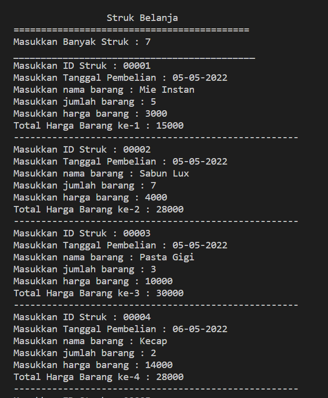

# **Laporan Praktikum 7**
# Jobsheet VII - Stack 
#### Oleh : Aryo Deva Saputra (TI-1G)
#### NIM : 2141720176

## 7.2 Praktikum 1
### 7.2.1 Langkah-langkah Percobaan 


### 7.2.2 Verifikasi Hasil Percobaan


### 7.2.3 Pertanyaan
1. Berapa banyak data pakaian yang dapat ditampung di dalam stack? Tunjukkan potongan kode program untuk mendukung jawaban Anda tersebut!
> **Banyaknya data yang dapat ditampung yaitu 5**
```java
    Stack stk = new Stack(5);
```
2. Perhatikan class StackMain, pada saat memanggil fungsi push, parameter yang dikirimkan adalah p. Data apa yang tersimpan pada variabel p tersebut?
```java
    stk.push(p);
```
> **Data yang tersimpan dalam parameter p tersebut adalah data pakaian yang bersisi jenis, warna, merk, ukuran, harga dari pakaian yang baru ditambahkan**
3. Apakah fungsi penggunaan do-while yang terdapat pada class StackMain?
   > **Agar input data kedalam stack dapat dilakukan berulang kali dan akan berhenti jika stack penuh atau user menghentikan pengisian data**
4. Modifikasi kode program pada class StackMain sehingga pengguna dapat memilih operasi-operasi pada stack (push, pop, peek, atau print) melalui pilihan menu program dengan memanfaatkan kondisi IF-ELSE atau SWITCH-CASE!


## 7.3 Praktikum 2
### 7.3.1 Langkah-langkah Percobaan 


### 7.3.2 Verifikasi Hasil Percobaan


### 7.3.3 Pertanyaan
1. Perhatikan class Postfix, jelaskan alur kerja method derajat!
   > **Method derajat digunakan untuk mengetahui seberapa besar nilai operator yang digunakan. Sebuah data (operator) yang bertipe char akan masuk ke dalam method derajat lalu di cek satu persatu dalam sintaks switch case. Jika operator sama dengan ^ maka akan mereturn nilai 3 atau nilai tertinggi dari sebuah derajat operator. Jika operator tidak sama dengan ^, namun sama dengan % maka akan mereturn nilai 2. Jika operator tidak sama dengan ^ dan %, namun sama dengan / maka akan mereturn nilai 2. Jika operator tidak sama dengan ^,%, dan /, namun sama dengan * maka akan mereturn nilai 2. Jika operator tidak sama dengan – atau + maka akan mereturn nilai 1. Dan jika tidak ada kesamaan operator yang diinputkan dengan perbandingandalam switch case maka akan mereturn nilai 0. Hal ini dilakukan untuk memberi keputusan apakah operator yang dimasukkan**
2. Apa fungsi kode program berikut?
```java
    c = Q.charAt(i);
```
> **Variabel c digunakan untuk menyimpan data char i ke dalam variable Q melalui sintaks charAt(i)**
   
3. Jalankan kembali program tersebut, masukkan ekspresi 3*5^(8-6)%3. Tampilkan hasilnya!


4. Pada soal nomor 3, mengapa tanda kurung tidak ditampilkan pada hasil konversi? Jelaskan!
> **Tanda kurung tidak ditampilkan dalam konversi karena hanya sebagai pembatas atau menanda dalam sintaks infix yang dirubah ke postfix. Terdapat kondisi apabila belum ditemukan ‘(‘ sebagai Top of Stack maka operator yang berada di atas ‘(‘ akan di push ke postfix hingga ‘(‘ merupakan Top of Stack setelah itu ‘(‘ dihapuskan dari stack tanpa dimasukkan ke dala postfix.**

## 7.4 Tugas
1. Perhatikan dan gunakan kembali kode program pada Praktikum 1. Tambahkan method getMin pada class Stack yang digunakan untuk mencari dan menampilkan data pakaian dengan harga terendah dari semua data pakaian yang tersimpan di dalam stack!
> **Kode Program**


> **Hasil running**


2. Setiap hari Minggu, Dewi pergi berbelanja ke salah satu supermarket yang berada di area rumahnya. Setiap kali selesai berbelanja, Dewi menyimpan struk belanjaannya di dalam laci. Setelah dua bulan, ternyata Dewi sudah mempunyai delapan struk belanja. Dewi berencana mengambil lima struk belanja untuk ditukarkan dengan voucher belanja.
Buat sebuah program stack untuk menyimpan data struk belanja Dewi, kemudian lakukan juga proses pengambilan data struk belanja sesuai dengan jumlah struk yang akan ditukarkan dengan voucher. Informasi yang tersimpan pada struk belanja terdiri dari:
<li>Nomor transaksi</li>
<li>Tanggal pembelian</li>
<li>Jumlah barang yang dibeli</li>
<li>Total harga bayar</li>
Tampilkan informasi struk belanja yang masih tersimpan di dalam stack!

> **Kode Program**
**Berada pada folder TUgas**

> **Hasil running**



