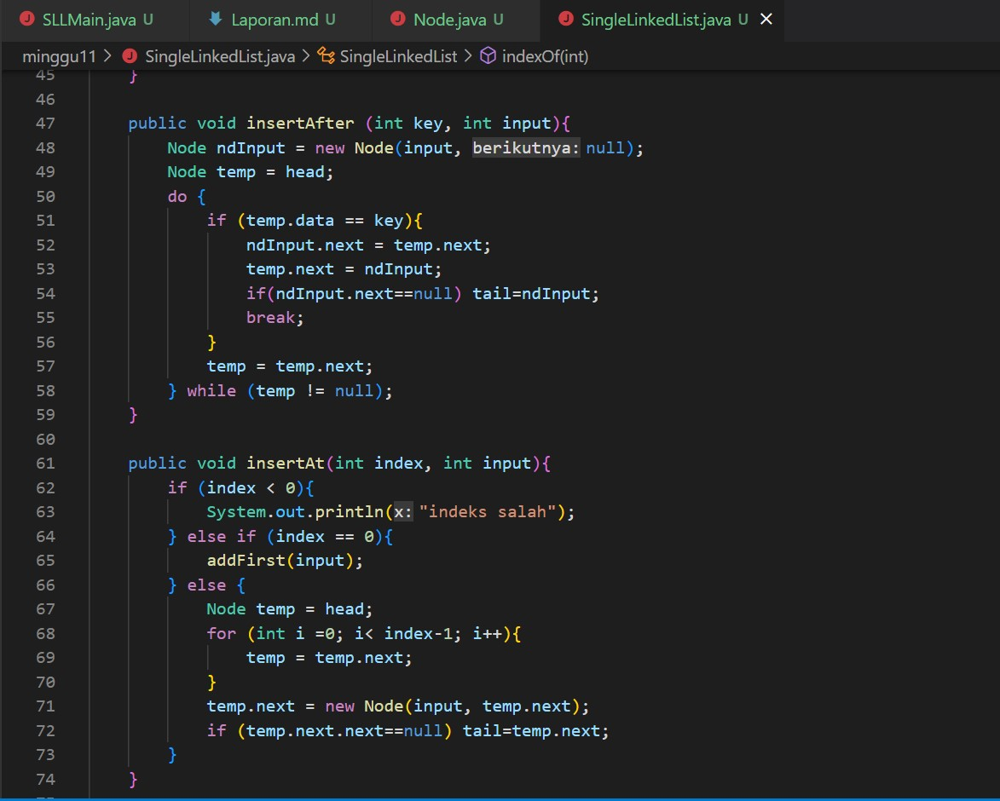

# **Laporan Praktikum**
# Jobsheet IX - Linked List 
#### Oleh : Aryo Deva Saputra (TI-1G)
#### NIM : 2141720176

## 2 Praktikum 
### 2.1 Pembuatan Single Linked List 





#### 2.1.1 Verifikasi Hasil Percobaan


#### 2.1.2 Pertanyaan
1. Mengapa hasil compile kode program di baris pertama menghasilkan “Linked List Kosong” ?
   > **Karena tidak ada data awal pada linked list tersebut, sehingga ketika method isEmpty dijalankan bernilai true yang artinya linked list kosong**
2. Pada step 10, jelaskan kegunaan kode berikut !
```java
ndInput.next = temp.next;
            temp.next = ndInput;
```
> **Agar data yang akan di inputkan sama dengan temp.next, setelah itu temp.next di isi dengan ndInput yang baru**
3. Perhatikan class SingleLinkedList, pada method insertAt Jelaskan kegunaan kode berikut !
```java
if (temp.next.next==null) tail=temp.next;
```
> **Untuk mengecek kondisi apakah temp.next.next null, jika iya maka tail=temp.next**

### 2.2 Modifikasi Elemen pada Single Linked List
#### 2.2.1 Langkah-langkah percobaan


#### 2.2.2 Verifikasi Hasil Percobaan


#### 2.2.3 Pertanyaan
1. Mengapa digunakan keyword break pada fungsi remove? Jelaskan!
   > **Agar penghapusan hanya dilakukan 1 kali**
2. Jelaskan kegunaan kode dibawah pada method remove
```java
else if (temp.next.data == key){
      temp.next = temp.next.next;
}
```
> **Untuk memindahkan alamat next yang lama ke alamat next yang baru setelah dilakukan penghapusan**
3. Apa saja nilai kembalian yang dapat dikembalikan pada method indexOf? Jelaskan maksud masing-masing kembalian tersebut!
> **Jika return -1 berarti data masih kosong jika selain itu maka akan return index data key**

## Tugas
1. Buat method insertBefore untuk menambahkan node sebelum keyword yang diinginkan!
   ```java
   public void insertBefore(int key, int input){
        int index = indexOf(key);
        insertAt(index, input);
   }
   ```
2. Implementasikan ilustrasi Linked List Berikut. Gunakan 4 macam penambahan data yang telah dipelajari sebelumnya untuk menginputkan data.


3. Buatlah Implementasi Stack berikut menggunakan Single Linked List


4. Buatlah implementasi program antrian untuk mengilustasikan mahasiswa yang sedang meminta tanda tangan KRS pada dosen DPA di kampus pada tugas jobsheet 8 menggunakan LinkedList. Implementasikan Queue pada antrian mahasiswa dengan menggunakan konsep LinkedList!